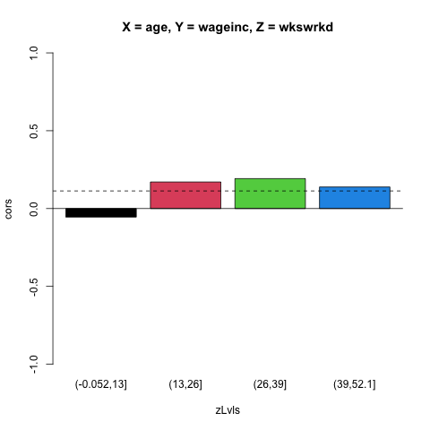
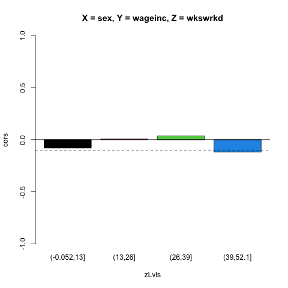
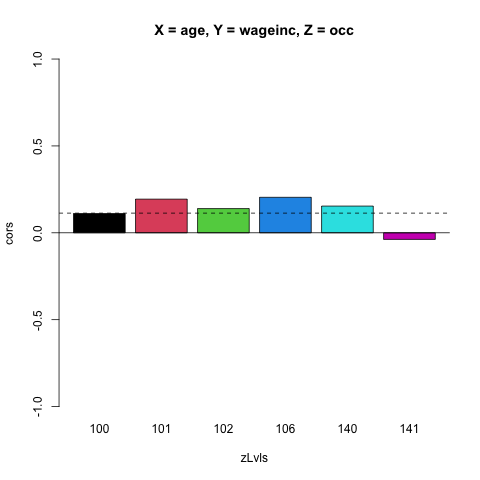

# Homework 1

## Due Monday, April 24, 11:59 pm

## Submitting homework (here and in future assignments)

Your file names must be named **Problem1.R**, **Problem2.R** and so on.

Package your files in **.tar** file.  E.g. on CSIF (Linux), Mac OS
  etc. 

```
$ tar cf your_group_member_email_addrs.tar names_of_your_files
```

Be sure to follow the file-naming rules in our syllabus exactly.  There
should be NO subdirectories created.  Check by unpacking,

```
$ tar xf your_group_member_email_addrs.tar
```

On CSIF, use the **handin** app. to submit your file to Yuyi:

```
$ handin lyy ecs189bHwk1 your_group_member_email_addrs.tar
```

This says, "Add my file **xxx.tar** to lyy's **ecs189bHwk1** handin
directory." (You can check that it got there; see the **handin** man
page.)

## Problem 1

### Goal: 

Get acquainted with Fair ML, using a simple example.

### Overview

Say we wish to predict Y from a feature vector X, where X =
(X<sub>1</sub>,...X<sub>p</sub>) includes a
senstive variable S such as race or gender.  We wish to eliminate the
effect of S on our predictions.

One might naively think that we can achieve this goal by simply removing
S from X.  However, this typically does not work, since there may be
other variables in X that are highly correlated with S. In such a
situation, S still will have an effect on our predictions.

For example, say S is age, and one of the other variables in X is number
of children.  Though of course we cannot predict S perfectly from this
variable, the correlation between the two will be substantial, so that S
will affect our prediction of Y to some degree even if we omit it.

In this problem, you will develop an exploratory tool to assess the
problem.  Which variables are good predictors of Y but are highly
correlated with S?

Note that the categorical case is generally viewed as having two
subcases:

* Dichtomous Y:  We code as 1 or 0, representing which of two cases we
  have. E.g. 1 for female, 0 for male.

* Multiclass Y, k classes: Code Y as (Y<sub>1</sub>,...,Y<sub>k</sub>),
  where Y<sub>i</sub> = 1 or 0, depending on whether Y is of class i or
  not.  E.g., for US political party, say we have Democrats, Republicans
  and those labeled as Decline to State. Here k = 3, and (0,1,0) would
  for instance mean Republican.

### Problem statement

You will write a function with call form

``` r
takeALookAround(data,yName,sName,maxFeatureSetSize)
```

where **yName** and **sName** are the names of columns in the data frame
**data**.

So our feature set is given by the column names of **data**, minus
**yName** and **sName**.  The tool will investigate the impact of
using various subsets of the feature set on 

* (a) prediction accuracy for Y of this feature set 

* (b) prediction accuracy for Y of this feature set plus S (how much are 
we giving up by NOT using S?)

* (c) prediction accuracy for S of this feature set (the better the
  accuracy, the less fairness value there is in omitting S from 
  prediction model)

The return value will be a data frame with 4 columns.  The first will be
a character string consisting of the names of the given feature set.
The second will be the prediction accuracy for (a), then the ones for
(b) and (c).  There will be one row in the d.f. for each feature set.
All possible feature sets of size up to **maxFeatureSetSize** will be
investigated.

### Details

* You are required to use [qeML](https://github.com/matloff/qeML). Stick
  to the default values.

* Use **qeLin()** for numeric Y or S, **qeLogit()** for the categorical
  case.  Have your code sense this by using **is.numeric()** or **is.factor()**.
  Use the test accuracy values they return.

### The qeLin() and qeLogit() functions

We'll be discussing these a few lectures from now, but for now here is
what you need to know:

* For numeric Y, **qeLin()** assumes a linear form for the mean Y given
  X, 

    E(Y | X) = &beta;<sub>0</sub> + &beta;<sub>0</sub> + X<sub>1</sub> + ... + &beta;<sub>p</sub> X<sub>p</sub>

   and estimates the coefficients in that linear form from the available
   (X,Y) data. 

* For dichotomous Y, **qeLogit()** assumes the probability of Y = 1 has
   a *logistic* form,

    P(Y = 1 | X) = 1 / [1 + exp{-{&beta;<sub>0</sub> + &beta;<sub>0</sub> + X<sub>1</sub> + ... + &beta;<sub>p</sub> X<sub>p</sub>}]

   Since the function l(t) = 1 / [1 + exp(-t)] is in (0,1), it's good for
   modeling a probability, and then we plug a linear form into that.
   Since l(t) is increasing in t, the larger the value of the linear
   form, the higher the resulting probability.

   (Some say the "log-odds ratio is linear"; true, but I believe it
   obscures the fact that we are working with a probability.

   Note:  Dichotomous Y could be coded with any 2 numbers, but the codes
   will be converted to 1 and 0.

* For multiclass Y, **qeLogit()** does k separate dichotomous runs.
  Then to predict a new case, it finds the estimated P(Y = class i | X),
  i = 1,...,k then does arg max.

Example:

``` r
> data(pef)
> head(pef)
       age     educ occ sex wageinc wkswrkd
1 50.30082 zzzOther 102   2   75000      52
2 41.10139 zzzOther 101   1   12300      20
3 24.67374 zzzOther 102   2   15400      52
4 50.19951 zzzOther 100   1       0      52
5 51.18112 zzzOther 100   2     160       1
6 57.70413 zzzOther 100   1       0       0
> qeLin(pef,'wageinc')$testAcc
holdout set has  1000 rows
[1] 24584.78
> qeLogit(pef,'sex')$testAcc
holdout set has  1000 rows
[1] 0.231
> qeLogit(pef,'occ')$testAcc
holdout set has  1000 rows
[1] 0.649
```

We first predicted wage income from all the other variables.  Our mean
absolute prediction error was more than $24,000.

We then predicted gender from all other variables.  We were incorrect
about 23% of the time.

Finally, we predict occupation, which has 6 different kinds of jobs.
Here we were wrong about 65% of the time.

To prevent overfitting, the qeML functions choose a random holdout set.
They fit the model to the nonholdout data, then use the fitted model to
predict the holdout.

### Example of output

For the **pef** data above, say Y is wage income and S is gender.  One
of the lines in the returned data frame will be

``` r
'age,occ' 31358.21 30381.26 0.217
```

Your numbers will be somewhat different, due to randomness arising from
the random holdout set.  But it seems using gender in addition to age
and occupation did improve prediction somewhat, but that those two
variables do have substantial correlation with S.

## Problem 2

Here you will write an R mini-package (just a single function, but very
useful).

### Goal

Simpson's Paradox (SP) describes a situation in which, roughly,

> relation(X,Y) is + but relation(X,Y|Z) is -, or vice versa

Usually, e.g. in the **UCBAdmissions** data, the variables X, Y and Z
are all categorical.  Your code here will explore whether SP seems to
hold for numeric X and Y (and maybe Z) for some given dataset..

### Requirements

The call form for your function will be

``` r
numericSimpsonfunction(data,xName,yName,zName,numZvals=NULL)
```

where

* **data** is an R data frame or equivalent

* **xName** is the name of the X column

* **yName** is the name of the Y column

* **zName** is the name of the Z column

* **numZvals** is the number of intervals to break Z into in the case
  where Z is a continuous variable

X and Y should either be continuous numeric variables or dichotomous R
factors.
We will define "relation" as one of two types of correlation:

* If both X and Y are continuous, use the classical Pearson
  correlation, available in R as **cor()**.

* If at least one of X and Y is dichotomous, use *Kendall's tau*
  correlation, code available in the **Kendall** package.  You should be
  able to use **install.packages()** to get this code.

In both cases, correlation varies between -1 and 1, with the correlation
being 0 if (but not only if) X and Y are independent.
Your function will partition the rows of **data** according to the
values of Z (after converting Z to intervals, if specified).  It will
then compute the correlation between X and Y within each group of rows.

Your pictures need not look exactly like mine, but they
must contain the same information as mine, including:

* Names of the X, Y and Z columns.

* Names of the Z levels (after preprocessing).

* Two horizontal bars, one of height 0 and the other of height equal to
  the unconditional correlation between X and Y.

It goes without saying, but just to make sure:  All this must be done
programmatically, i.e. via code; you should not make the user add the
plot title by hand, for instance.

It's your choice as to what R graphics library you will use (but it must
be R).  My own version of the code just uses base-R graphics, mainly
**barplot()**.

**NOTE CAREFULLY:**  Make absolutely sure that you agree that the above
approach does a reasonable job of achieving the goals of this problem.
Don't "Miss the forest (concepts of SP) for the trees (plotting
functions etc.)."

## Examples

``` rc
> source('Problem2.R')
> library(Kendall)
> library(qeML)
> data(pef)
> head(pef)
       age     educ occ sex wageinc wkswrkd
1 50.30082 zzzOther 102   2   75000      52
2 41.10139 zzzOther 101   1   12300      20
3 24.67374 zzzOther 102   2   15400      52
4 50.19951 zzzOther 100   1       0      52
5 51.18112 zzzOther 100   2     160       1
6 57.70413 zzzOther 100   1       0       0
> numericSimpson(pef,'age','wageinc','wkswrkd',4)
> pr2file('Example1.png')  # see code below
> numericSimpson(pef,'sex','wageinc','wkswrkd',4)
> pr2file('Example2.png')
> numericSimpson(pef,'age','wageinc','occ',4)
> pr2file('Example3.png')

```

  
  
  

**NOTE CAREFULLY:**  Recall that a data outcome is subject to sampling
error, due to variation in that value from one sample to another from
the same (possibly conceptual) population.  One cannot take these
pictures to be precise.  Note too, that even with a very large dataset,
where these reported calculations would have small standard errors,
correlations near 0 are probably not of interest in terms of SP.  I
recommend that you at least read Extra Credit Problem B below, even if
you do not work on it.

## Coding tips

I'd suggest that you browse through the code of a small package, 
such as my 
[toweranNA](https://cran.r-project.org/web/packages/toweranNA/index.html)
package.  Note e.g. R functions like **is.factor()** and how default
arguments are handled in R.

## Extra Credit Problem A 

(Submit in a file **ECA.R**.)

Find a real dataset, in which at least one of X and Y is a continuous
variable, in which SP hold.  Write your jode as a function call
**spExample()** (no arguments).  It will fetch the dataset, perform any
needed preprocessing, and then call **numericSimpson()**.

## Extra Credit Problem B 

(Submit in a file **ECB.R**.)

It would be nice to condition on two factors, e.g. gender and
occupation.  There Z would be an R factor with 2 X 6 = 12 levels,
representing a categorical variable of 12 categories.

Write a function with call form

``` r
superFactor(f1,f2)
```

which returns a new factor that is a combination of factors **f1** and
**f2** as described above.

## Extra Credit Problem C 

(Submit in a file **ECC.R**.)

Here we address the issue raised earlier about sampling variability.

At the famous CS machine learning conferences (and in other fields), one
often see *error bars* in graphs of data.  These form an approximate 95%
confidence interval for the plotted quantity (analogous to the
confidence rings in the graphs produced by **vcd::fourfold()**).

One general way to generate confidence intervals--general in the sense
that it applies to (almost) any estimator--is the *bootstrap*.  The
essence of it is this:

* Denote our estimator by T, say the correlation for a given Z level.

* Generate m random subsets of the dataset, each of size n-k.

* Calculate T on each subset.

* Take our approximate 95% confidence interval to be the 2.5 and 97.5
  percentiles of T (e.g. using R's **quantile()** function).

Write a function **addErrorBars()** to a graph produced by
**numericSimpson()**.

